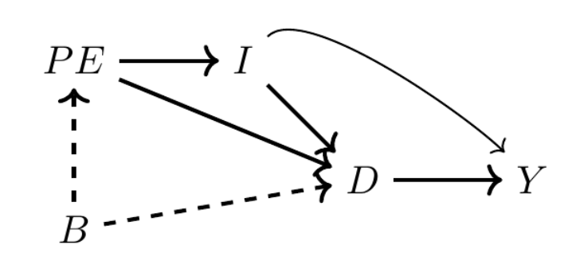

## Causal Effects & Dag's

Direct (D -\> Y) or mediated (D -\> X -\> Y)



Above example: does college education (D) increase earnings (Y)

D -\> Y (causal effect)

D \<- I -\> Y (backdoor path #1)

D \<- PE -\> I -\> Y (backdoor path 2)

D \<- B -\> PE -\> I -\> Y (backdoor path 3)

Remember colliding, collider bias

ditto backdoor criterion

## "Language" Overview

We're interested in inferring causation. Mill (2010) devises 5 methods:\
(1) method of agreement

\(2\) the method of difference\*\*

\(3\) the joint method

\(4\) the method of concomitant variation

\(5\) the method of residues

Number two – the method of difference – is most similar to the idea of causation as a comparison among counterfactuals: "If a person eats of a particular dish, and dies in consequence, that is, would not have died if he had not eaten it, people would be apt to say that eating the dish was the source of his death"

#### Potential Outcomes -

Assume a binary variable that takes value = 1 if a particular unit $i$ receives the treatment, 0 if not.

Each unit has two potential outcomes (only one observed - these are two states of the world for the same unit):

$Y^1_i$ if unit $i$ received the treatment

$Y^0_i$ if unit $i$ did not receive the treatment

$Y^1$ potential outcome under state of the wold where the treatment occured

$Y^0$ potential outcome under state of the world where the treatment did not occur

-   are hypothetical random variables that differ across the population

#### Observable or "Actual" Outcomes -

$Y_i$

-   do not have superscript

-   are not potential outcomes

-   are "realized, historical, actual, empirical" outcomes that unit $i$ experienced

#### "Switching Equation" Gets us from Potential to Actual Outcomes -

$$
Y_i = D_iY^1_i + (1-D_i)Y^0_i
$$

$D_i$ = 1 if unit $i$ received the treatment, 0 if not

When $D_i = 1$, then $Y_i = Y^1_i$ because second term zeros out.

When $D_i - 0$, then $Y_i = Y^0_i$

Conditional Expectations

OLS/models

#### Treatment Effects Estimation (Pot. Outcomes)

$$
ATE = E[\delta_i]
= E[Y^1_i - Y^0_i]
= E[Y^1_i] - E[Y^0_i]
$$

"*Average treatment effect."*

-   requires both potential outcomes for each $i$ unit

-   only know one outcome ever, inherently unknowable – thus what we estimate

$$
ATT = E[\delta_i|D_i=1]
= E[Y^1_i - Y^0_i | D_i = 1]
= E[Y^1_i | D_i = 1] - E[Y^0_i| D_i = 1]
$$

*"Average treatment Effect for the treated"*

-   is that population mean treatment effect for the group of units assigned to the treatment in the first place according to the switching equation.

-   also unknowable because we don't know both outcomes

    -   unobserved counterfactual is $Y^0_i|D=1$

**Simple Difference in Means**

$$
E[Y^1|D=1]-E[Y^0|D=0]
$$

(Why is this different from the ATT? ) This is *the difference between treated units under treatment and untreated units under control.* Neither the ATT or ATE in general.

Difference in sample means of the observed outcome between:

-   units that received the treatment ($d_i =1$)

-   units that didn't receive the treatment $d_i=0$

Can be computed as:

$$
\frac{1}{N_T}\sum_{i=1}^{n} (y_i|d_i=1) - \frac{1}{N_C}\sum_{i=1}^{n}(y_i|d_i=0)
$$

Where

-   $N_T = \sum_{i}1(d_i=1)$ = number of treated units

-   $N_T = \sum_{i}1(d_i=0)$ = number of control units

-   $y_i$ is the observed outcome for unit $i$

What is this? It is not:

-   a causal estimand by itself

-   it does not reference counterfactuals

-   it does not compare he same units under different treatment states

It *is entirely in observed-data space*. Uses only $(Y_i, D_i)$

This difference in means - under just law of large numbers, so weak conditions – converges to: $E[Y|D=1] - E[Y|D=0]$

The switching equation lets us rewrite as: $E[Y(1)|D=1] - E[Y(0)|D=0]$

So - (Why is this different from the ATT? ) This is *the difference between treated units under treatment and untreated units under control.* Neither the ATT or ATE in general.

**The difference in means is equal to the ATE plus baseline differences plus effect heterogeneity.**

$$
E[Y(1)|D=1] - E[Y(0)|D=0] = E[Y(1)-Y(0)]  
$$

$$
+
$$

$$
E[Y(1)|D=0]+E[Y(0)|D=0]
$$ (baseline differences)

$$
+
$$

$$
(1-\pi)(E[\delta|D=1]-E[\delta|D=0])
$$ (effect heterogeneity)

Unless both baseline differences and effect heterogeneity are = 0, the simple difference in means is biased. **But sometimes dif in means is = ATT and ATE.**

**Simple Difference *does* Equal ATE when treatment is randomly assigned:**

$$
Y(1), Y(0) \perp\!\!\!\perp Y 
$$

**Simple Difference *does* Equal ATT if baseline outcomes across groups are equal:**

$$
E[Y(0)|D=1] = E[Y(0)|D=0]  
$$

```{r}
library(tidyverse)
library(haven)

read_data <- function(df)
{
  full_path <- paste("https://github.com/scunning1975/mixtape/raw/master/", 
                     df, sep = "")
  df <- read_dta(full_path)
  return(df)
}

yule <- read_data("yule.dta") %>% 
  lm(paup ~ outrelief + old + pop, .)
summary(yule)
```
